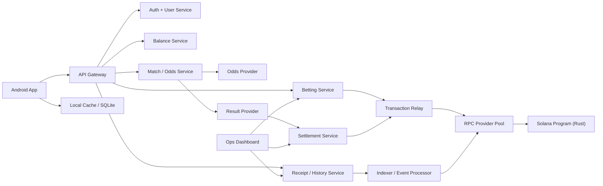

# System Design: Solana-Based Sports Betting Platform Using HTGN Stablecoins

This document builds on [requirements.md](/Users/jad/Desktop/Week%205/Nclusion/requirements.md) and [interviews.md](/Users/jad/Desktop/Week%205/Nclusion/interviews.md). It defines the recommended MVP architecture for a low-bandwidth, Android-first sports betting platform for the Haitian market using HTGN stablecoins and Solana devnet.

---

## 1. Design Objective

Build a betting system that is:

- usable on intermittent 2G/3G,
- credible on low-end Android devices,
- transparent enough to earn user trust,
- operationally manageable for an MVP,
- and blockchain-backed only where blockchain meaningfully improves trust.

The design choice throughout this document is consistent:

- keep **bet escrow and settlement on-chain**,
- keep **live odds, retry handling, caching, indexing, and UX state off-chain**,
- and present the user with a **fintech-style mobile experience**, not a crypto app.

---

## 2. Architecture Principles

### Product principles

- Invisible blockchain in the primary UX
- Trust through status clarity and receipts
- Local-first data access
- Clear handling of weak connectivity
- Narrow World Cup-focused MVP scope

### System principles

- Mobile clients should not talk directly to Solana RPC
- All write operations must be idempotent
- On-chain state must be minimal and canonical
- Off-chain state may be denormalized for speed and supportability
- Failure states must be explicit and recoverable

---

## 3. High-Level Architecture

---

## 4. Core Components

## 4.1 Android App

Primary responsibilities:

- authentication and session handling,
- local language UI in Haitian Creole and French,
- local caching of matches, balances, and bet history,
- bet slip creation,
- queueing user intents under poor connectivity,
- rendering user-facing status transitions.

Key constraints:

- Android 8+,
- 2GB RAM,
- 5-inch screens,
- low and unstable bandwidth.

Client design (locked in [`techstack.md`](./techstack.md)):

- React Native bare workflow with Hermes engine
- op-sqlite for durable local storage (JSI-based, WAL mode)
- Zustand for state management with SQLite persistence
- React Navigation v7 with native-stack
- compact DTOs for network responses
- image-light UI with minimal decorative assets
- explicit connection state banner: `Offline`, `Limited connection`, `Synced`

## 4.2 API Gateway

Primary responsibilities:

- single mobile-facing API surface,
- auth enforcement,
- request shaping and payload minimization,
- idempotency handling for mutation requests,
- rate limiting and abuse controls.

The gateway should present coarse mobile endpoints rather than exposing internal services directly.

## 4.3 Auth and User Service

Primary responsibilities:

- phone-based or lightweight identity-based sign-in,
- session issuance,
- mapping user identities to managed wallet records,
- account recovery workflows.

The user must not be required to handle seed phrases in the MVP.

## 4.4 Match and Odds Service

Primary responsibilities:

- ingest real sports data from an external odds provider,
- normalize match and market data,
- precompute compact mobile payloads,
- serve delta updates,
- maintain TTL-based cache.

This service is off-chain by design. Live odds should never be pushed directly on-chain for the MVP.

## 4.5 Betting Service

Primary responsibilities:

- accept bet intents from clients,
- validate market availability and stake rules,
- reserve user funds in the shadow ledger,
- generate deterministic bet identifiers,
- coordinate relay submission,
- update the bet status state machine.

This is the main business orchestration layer.

## 4.6 Balance Service

Primary responsibilities:

- maintain user-visible balance views,
- separate `available`, `reserved`, and `pending settlement`,
- reconcile chain events and settlement outcomes,
- serve cached balances even under temporary backend degradation.

This service exists because raw on-chain balance reads are too slow and too incomplete for the UX needed here.

## 4.7 Transaction Relay

Primary responsibilities:

- turn accepted betting intents into chain submissions,
- sponsor transaction fees,
- manage retries,
- deduplicate submissions,
- choose healthy RPC endpoints,
- track transaction confirmation stages.

This service is mandatory for transaction resilience in Haiti-like network conditions.

## 4.8 Solana RPC Provider Pool

Primary responsibilities:

- multi-provider failover,
- health checks,
- confirmation tracking,
- timeout and retry policies,
- provider selection based on latency and availability.

The mobile app should never depend on a single public RPC endpoint.

## 4.9 Solana Program

Primary responsibilities:

- escrow staked HTGN,
- record canonical bet state,
- enforce settlement logic,
- release winnings or mark losses,
- preserve an auditable settlement path.

The program should remain intentionally narrow. It should not attempt to become a full on-chain sportsbook engine for live odds management.

## 4.10 Settlement Service

Primary responsibilities:

- ingest final match results,
- cross-check results across providers,
- hold ambiguous outcomes for manual review,
- prepare settlement actions,
- submit settlement transactions through the relay.

## 4.11 Indexer / Event Processor

Primary responsibilities:

- consume program events or account changes,
- map chain activity into queryable history,
- update receipts and support records,
- feed the balance and history services.

This component exists to avoid expensive mobile reads against the chain.

## 4.12 Ops Dashboard

Primary responsibilities:

- inspect bets and status transitions,
- review disputed settlements,
- view transaction receipts,
- investigate failures,
- monitor health metrics.

Even with on-chain settlement, operational tooling is required for trust and support.

---

## 5. On-Chain vs Off-Chain Boundary

### On-chain

- escrowed HTGN stake
- canonical bet record
- accepted odds snapshot
- outcome selection
- settlement result
- payout execution

### Off-chain

- live odds feeds
- match browsing payloads
- connection-aware UX state
- localized copy
- user sessions and recovery
- bet history indexing
- support views
- telemetry
- risk scoring

This split is the strongest fit for the assignment because it concentrates blockchain where user trust matters most while preserving data efficiency and resilience.

---

## 6. Primary User Flows

## 6.1 Match Browsing Flow

1. Client requests compact match feed from API gateway.
2. Match service returns cached fixtures plus delta updates.
3. Client writes data to local SQLite.
4. If offline, app reads from local cache and labels freshness explicitly.

Design goal:

- browsing must still work when the network is weak or absent.

## 6.2 Bet Placement Flow

1. User selects match outcome and stake.
2. Client shows confirmation with stake, accepted odds preview, and potential payout.
3. Client sends bet intent with idempotency key.
4. Betting service validates market, stake, balance, and current odds window.
5. Balance service reserves funds in shadow ledger.
6. Betting service writes status `Queued` or `Accepted for relay`.
7. Transaction relay submits transaction through healthy RPC provider.
8. Solana program escrows HTGN and records canonical bet.
9. Relay updates status to `Confirmed on-chain`.
10. Client receives updated receipt and local history cache is updated.

If connectivity drops after step 3:

- the bet remains visible as `Queued` or `Processing`,
- no false finality is shown,
- replay-safe retry behavior is driven by the idempotency key and deterministic bet identifier.

## 6.3 Offline Bet Intent Flow

1. User builds a bet slip while offline or on degraded network.
2. Client stores the pending intent locally with a short expiration window.
3. App clearly labels the bet as `Not submitted`.
4. When connectivity returns, the app attempts submission.
5. Betting service revalidates current odds and market status.
6. If odds moved outside tolerance, the app requires reconfirmation.

Design goal:

- preserve continuity without accepting stale or misleading offline bets.

## 6.4 Settlement Flow

1. Settlement service receives final match result.
2. Primary and secondary provider results are compared.
3. If consistent, settlement batch is prepared.
4. Relay submits settlement transaction.
5. Solana program marks bets as won, lost, or cancelled and releases payouts.
6. Indexer updates bet history, receipts, and balances.
7. Client sees `Settled` state and updated winnings.

If providers disagree:

- market is held for manual review,
- users see a clear pending settlement notice,
- no settlement is forced until the dispute is resolved.

---

## 7. Bet State Machine

Recommended user-facing states:

- `Draft`
- `Queued`
- `Processing`
- `Confirmed`
- `Pending settlement`
- `Won`
- `Lost`
- `Cancelled`
- `Failed`

Recommended internal states:

- `intent_created`
- `validation_passed`
- `funds_reserved`
- `relay_submitted`
- `signature_received`
- `chain_confirmed`
- `awaiting_result`
- `settlement_submitted`
- `settlement_confirmed`
- `reverted_or_released`

Rule:

- user-facing states should remain simple,
- internal states should be more granular for observability and support.

---

## 8. Data Model

## 8.1 Core Entities

### User

- `user_id`
- `phone_or_identity_ref`
- `language_preference`
- `managed_wallet_id`
- `status`

### Managed Wallet

- `wallet_id`
- `public_key`
- `custody_mode`
- `recovery_metadata_ref`

### Match

- `match_id`
- `competition`
- `home_team`
- `away_team`
- `start_time`
- `status`
- `result_state`

### Market

- `market_id`
- `match_id`
- `market_type`
- `odds_home`
- `odds_draw`
- `odds_away`
- `odds_version`
- `expires_at`

### Bet Intent

- `intent_id`
- `user_id`
- `market_id`
- `selection`
- `stake_htgn`
- `displayed_odds`
- `idempotency_key`
- `client_created_at`
- `submission_expiry`

### Bet Record

- `bet_id`
- `intent_id`
- `user_id`
- `accepted_odds`
- `stake_htgn`
- `potential_payout_htgn`
- `program_account_ref`
- `tx_signature`
- `status`

### Settlement Record

- `settlement_id`
- `match_id`
- `provider_result`
- `cross_check_result`
- `settlement_tx_signature`
- `status`

### Balance View

- `user_id`
- `available_htgn`
- `reserved_htgn`
- `pending_settlement_htgn`
- `last_reconciled_at`

---

## 9. Solana Program Design

## 9.1 Program Scope

The Rust program should support a minimal instruction set:

- initialize market escrow
- place bet
- settle market
- cancel market if needed
- release or credit funds

The program should not own:

- odds ingestion,
- result polling,
- user identity,
- support workflow,
- mobile-facing history queries.

## 9.2 Account Strategy

Recommended approach:

- deterministic PDAs for market and bet records,
- market-level escrow pool instead of fully separate escrow accounts for every logical step,
- compact bet receipts on-chain,
- display-heavy metadata off-chain in the indexer.

Rationale:

- lower rent overhead,
- smaller account footprint,
- simpler indexing,
- better long-term scalability than verbose per-bet storage.

## 9.3 Suggested On-Chain Data Per Bet

- `bet_id`
- `user_wallet`
- `market_id`
- `selection`
- `stake_amount`
- `accepted_odds`
- `status`
- `created_slot_or_timestamp`

Optional but useful:

- `settlement_reference`
- `payout_amount`

## 9.4 Program Safety Controls

- deterministic bet IDs to prevent duplicates
- authority constraints on settlement
- cancellation path for invalidated markets
- explicit status transition enforcement
- upgrade authority managed with staged governance

---

## 10. Mobile Data Strategy

The mobile design should assume the network is expensive and unstable.

### Required tactics

- gzip or brotli response compression
- delta updates for match and odds feeds
- no direct client polling of Solana
- no large images by default
- TTL-based local caching
- batched client telemetry uploads
- local language bundles embedded in the app

### Sync model

- foreground refresh on app open
- cheap periodic refresh for high-interest matches only
- manual refresh affordance when users want certainty
- sync suspended gracefully under low battery or poor connectivity

### Storage model

- SQLite tables for matches, markets, balances, bet history, and pending intents
- bounded retention for stale matches and old feed snapshots
- recent bet history persisted longer than browsing data

---

## 11. Trust and UX Design Decisions

The interviews point to a clear trust model:

- users should never be forced to understand crypto,
- users should always understand bet status,
- transparency should be available on demand,
- pricing changes should require reconfirmation,
- balances must explain locked versus spendable funds.

### Main UX patterns

- simple statuses: `Sending`, `Processing`, `Confirmed`, `Settled`
- balance breakdown: `Available`, `In active bets`, `Pending settlement`
- receipt screen with optional advanced proof
- explicit freshness labeling on cached match data
- helpful failure messages instead of generic errors

### Receipt design

Each receipt should expose:

- match and market
- accepted odds
- stake
- potential payout
- current status
- placed time
- settlement outcome

Advanced receipt fields:

- transaction signature
- program reference
- settlement signature

---

## 12. Security and Risk Controls

## 12.1 Transaction Integrity

- idempotency keys on all bet submissions
- deterministic bet IDs in program logic
- replay-safe relay submission
- confirmation tracking before status promotion

## 12.2 Custody and Key Management

- managed wallets for MVP
- secure server-side signing boundary
- recovery flows tied to verified user identity
- future export path after product maturity

## 12.3 Fraud and Abuse

- device and session reputation
- velocity checks on repeated bet attempts
- stake limits in early launch
- abnormal pattern detection
- escalation only when needed to avoid harming core UX

## 12.4 Settlement Risk

- dual-provider result verification
- manual hold on disputed matches
- auditable settlement event trail

---

## 13. Observability and Operations

## 13.1 Metrics

Track at minimum:

- app open to first match load latency
- first bet completion rate
- bet confirmation success rate
- duplicate submission prevention rate
- settlement completion rate
- stale odds rejection rate
- offline queue count
- support ticket rate per settled bet

## 13.2 Logging

Server logs:

- bet lifecycle transitions
- relay retries
- RPC provider failures
- settlement discrepancies
- balance reconciliation mismatches

Client logs:

- deferred upload only
- compressed event batches
- privacy-safe error fingerprints

## 13.3 Operator Tools

Operators need screens for:

- user bet search
- receipt lookup
- chain transaction lookup
- result dispute review
- stuck bet investigation

---

## 14. Failure Handling

## 14.1 Mobile Network Failure

Behavior:

- fall back to cache,
- allow browsing,
- allow intent drafting,
- show connection-aware status,
- defer write submission safely.

## 14.2 RPC Failure

Behavior:

- relay fails over to secondary provider,
- transaction status remains `Processing`,
- no duplicate promotion to `Confirmed` without chain evidence.

## 14.3 Odds Drift

Behavior:

- submission blocked if outside tolerance,
- user prompted to accept new odds,
- reserved funds released if bet is not reconfirmed.

## 14.4 Result Feed Conflict

Behavior:

- settlement paused,
- market flagged,
- users see delayed settlement notice,
- manual review required.

## 14.5 App Restart During Pending Bet

Behavior:

- pending intent restored from local storage,
- latest server status fetched,
- duplicate submission prevented by idempotency key.

---

## 15. MVP Deployment Plan

## Phase 1: Thin vertical slice

- one competition
- basic match feed
- managed wallet creation
- HTGN balance display
- single bet flow
- relay to Solana devnet

## Phase 2: Reliable betting loop

- local caching
- idempotency protections
- receipt pages
- settlement orchestration
- history and balance reconciliation

## Phase 3: Operational hardening

- multi-RPC failover
- dual-provider result checks
- operator dashboard
- deferred telemetry
- abuse controls

---

## 16. Open Design Questions

- ~~What is the exact HTGN custody model on devnet for the assignment demo?~~ **Resolved:** SPL Token on devnet, platform-controlled mint, 2 decimals, backend faucet for demo wallets. See [`techstack.md`](./techstack.md).
- ~~Will Nclusion provide an existing balance API, or should the demo simulate one?~~ **Resolved:** We build our own shadow ledger via the Balance Service with `available`, `reserved`, and `pending_settlement` views, reconciled against on-chain state.
- ~~Which sports data provider is the most realistic fit for World Cup coverage and low-cost MVP use?~~ **Narrowed:** The Odds API or API-Football. Final selection during P0. See [`techstack.md`](./techstack.md).
- What degree of identity verification is expected for the assignment versus a real launch?
- Should recovery be phone-number-first only, or tied to an additional operator-assisted recovery path?

---

## 17. Recommended Final Positioning

The strongest architectural story for this assignment is:

> A low-bandwidth, Android-first sportsbook that uses Solana only for the trust-critical path of escrow and settlement, while using a relay, local caching, and clear status UX to make blockchain invisible to the end user.

That positioning aligns with:

- the constraints in [requirements.md](/Users/jad/Desktop/Week%205/Nclusion/requirements.md),
- the technical choices surfaced in [interviews.md](/Users/jad/Desktop/Week%205/Nclusion/interviews.md),
- the locked technology stack in [techstack.md](/Users/jad/Desktop/Week%205/Nclusion/techstack.md),
- the deployment strategy in [production.md](/Users/jad/Desktop/Week%205/Nclusion/production.md),
- and the business need to earn trust in a market where reliability matters more than crypto branding.
